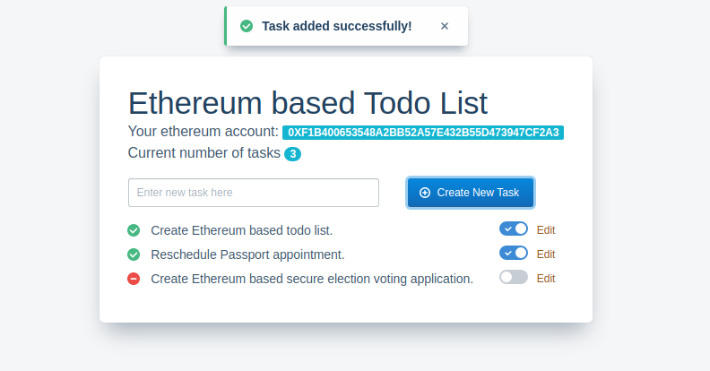

# Ethereum based Todo-List

A todo list build for Ethereum blockchain.

### Screenshot



### Dependencies

- Ganache GUI or cli
- Truffle
- Metamask browser extension

```bash

npm install -g ganache-cli
npm install -g truffle

```

### How to use

- Clone this repo. Then follow below instructions.

```bash

ganache-cli (this will start ganache)
// or ganache-cli --db directory (to save the state of the blockchain)
cd blockchain
truffle migrate

```

> Note the address at which the TodoList contract is deployed. Replace this with the one in .env file in client folder.

```bash

cd client
npm run start

```
